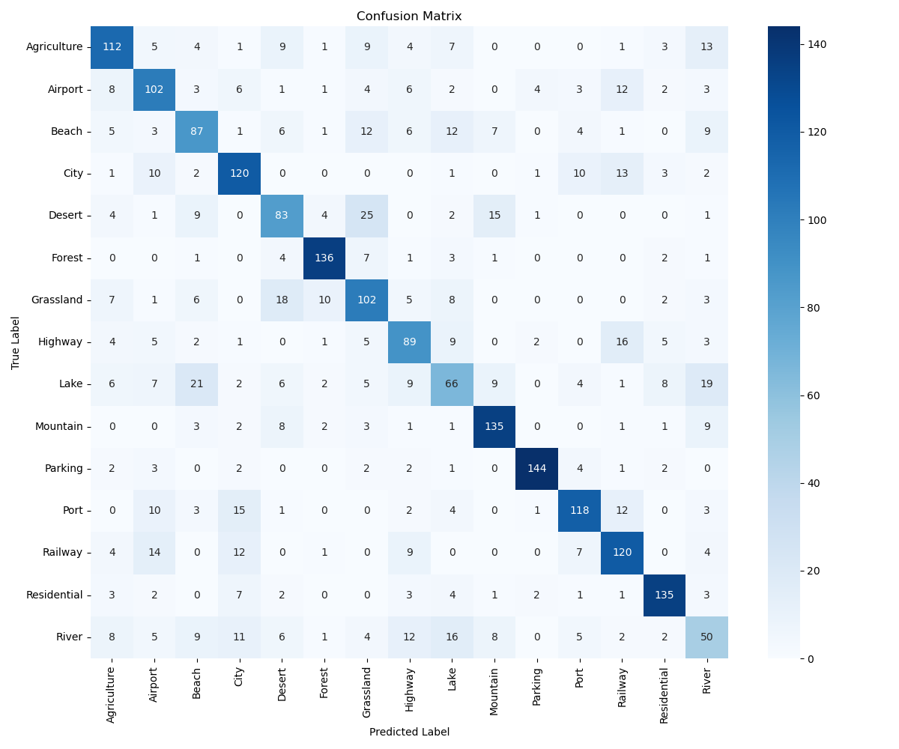
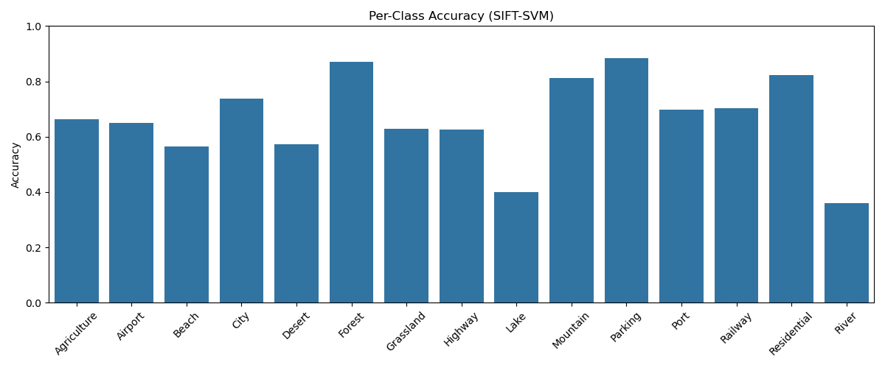
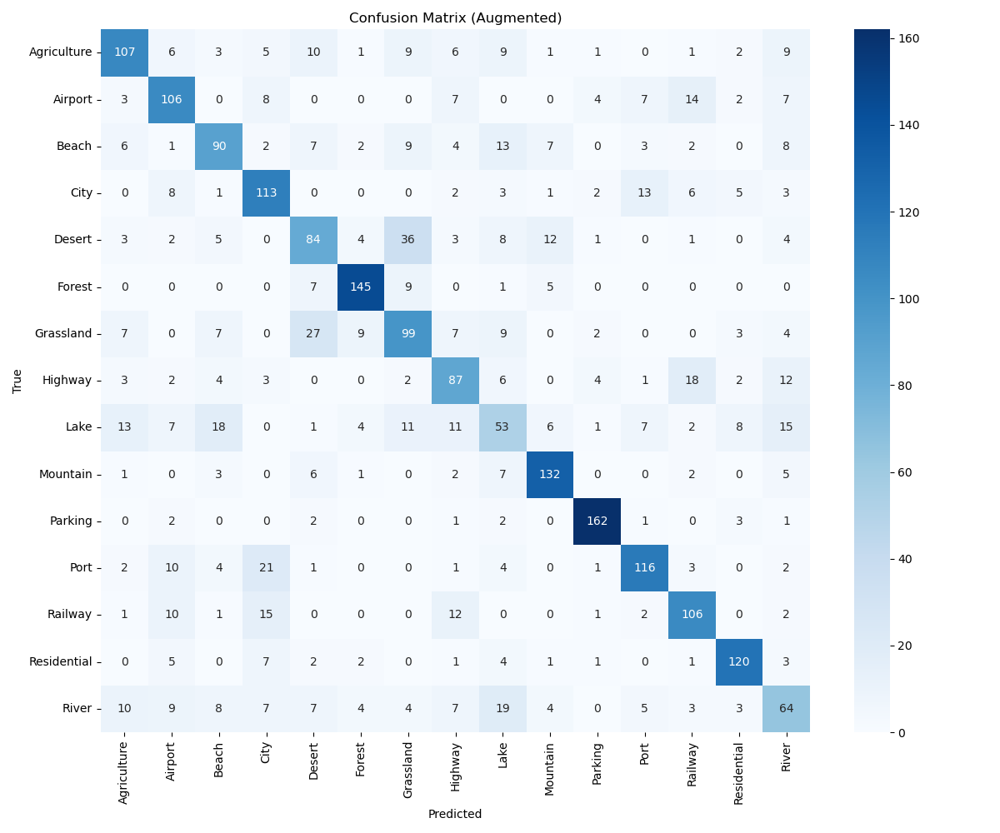
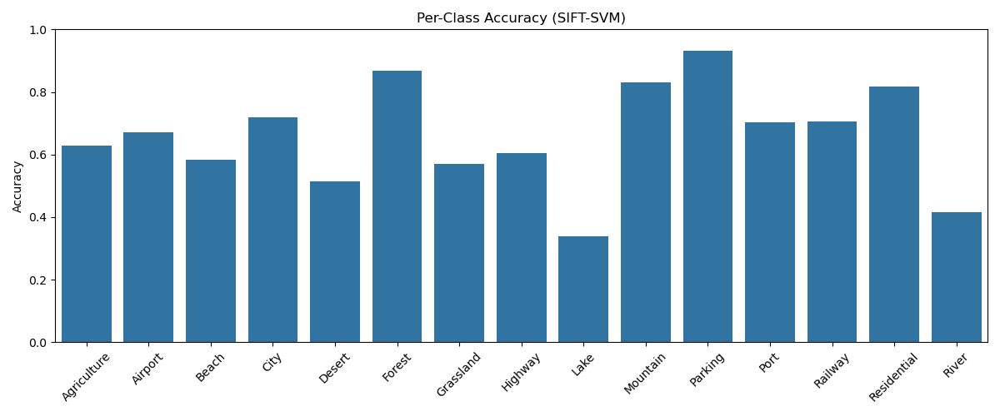
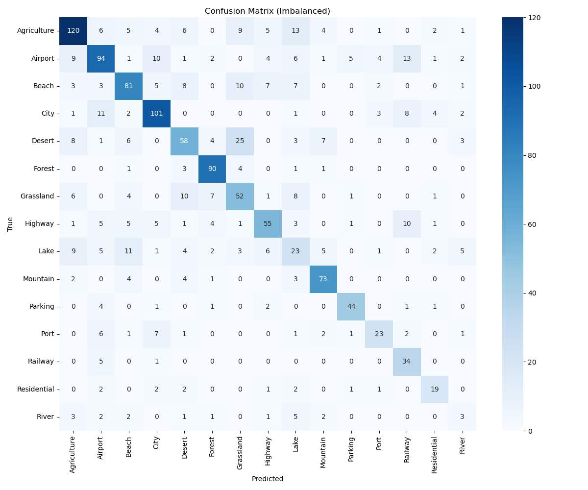

# 🛰️ SIFT-SVM: Aerial Landscape Classification using SIFT and Bag-of-Visual-Words

This repository implements a feature-based classification pipeline using **SIFT descriptors**, **Bag-of-Visual-Words (BoVW)** representation, and an **SVM classifier** for classifying aerial images into 15 categories.

---

## 📁 Project Overview

This repo includes three versions of the SIFT-SVM classification pipeline:

| Version | Script | Description |
|---------|--------|-------------|
| ✅ Original | `SIFT-SVM_original.ipynb` | Implemented in Jupyter Notebook |
| 🧪 Augmented | `SIFT-SVM_augmentation.py` | Implemented in `.py` due to Jupyter memory issues |
| ⚖️ Imbalanced | `SIFT-SVM_imbalanced.py` | Simulates imbalanced class distribution, also `.py` |

> ⚠️ Note:  
> Due to **memory limitations in Jupyter Notebook**, the augmented and imbalanced versions were implemented and executed in **PyCharm** using `.py` scripts.  
> Additionally, only `kmeans_bovw_imbalanced.pkl` is included in this repository, as the other KMeans models exceeded GitHub's 25MB file upload limit.

---

## 📦 Dataset

- **Dataset name:** `Aerial_Landscapes`
- **Categories (15):**  
  `Agriculture`, `Airport`, `Beach`, `City`, `Desert`, `Forest`, `Grassland`, `Highway`, `Lake`, `Mountain`, `Parking`, `Port`, `Railway`, `Residential`, `River`
- All images are resized to **256×256** and converted to **grayscale**.

---

## 🧠 Method Summary

| Aspect         | SIFT-SVM                            |
|----------------|-------------------------------------|
| Feature Type   | SIFT keypoints (scale-invariant)    |
| Representation | Bag of Visual Words (KMeans, k=100) |
| Classifier     | SVM with RBF kernel                 |
| Output         | Confusion matrix, per-class accuracy |

---

## 📊 Results Visualization

| Version     | Confusion Matrix                            | Per-Class Accuracy                            |
|-------------|----------------------------------------------|-----------------------------------------------|
| Original    |       |       |
| Augmented   |  |  |
| Imbalanced  |  |  |

---

## ⚙️ Usage Instructions

### 🔧 Requirements

```bash
pip install numpy opencv-python scikit-learn matplotlib seaborn tqdm joblib
```

### 📁 Dataset Preparation

> ⚠️ The dataset is **not included** in this repository due to size.  
> Please manually place the dataset in the following structure:

```
SIFT-SVM/
├── Aerial_Landscapes/
│   ├── Agriculture/
│   ├── Airport/
│   ├── ...
```

### 🚀 Running the Models

- Run the original version in Jupyter:

```bash
jupyter notebook SIFT-SVM_original.ipynb
```

- Run augmented and imbalanced versions in PyCharm or terminal:

```bash
python SIFT-SVM_augmentation.py
python SIFT-SVM_imbalanced.py
```

---

## 📁 File Structure

```
├── SIFT-SVM_original.ipynb
├── SIFT-SVM_augmentation.py
├── SIFT-SVM_imbalanced.py
├── confusion_matrix_sift.png
├── confusion_matrix_augmented_sift.png
├── confusion_matrix_imbalanced_sift.png
├── per_class_accuracy_sift.png
├── per_class_accuracy_augmented_sift.png
├── per_class_accuracy_imbalanced_sift.png
├── kmeans_bovw_imbalanced.pkl       # Only this KMeans model is included
├── svm_classifier*.pkl              # Trained SVM models
├── label_encoder*.pkl               # Label encoders
```

---

## 📬 Contact

Feel free to open an issue or reach out if you have any questions!

> Created with ❤️ by **Liwenqing Liu**
